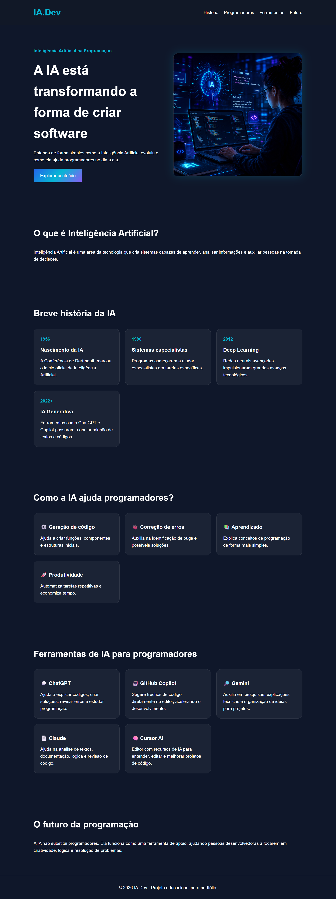

# IA.Dev - Inteligência Artificial na Programação

Landing Page responsiva desenvolvida para apresentar a evolução da Inteligência Artificial e seu impacto no desenvolvimento de software.

O projeto foi construído com HTML5 e CSS3 puros, utilizando uma interface moderna, tema escuro e elementos visuais inspirados em tecnologia e inovação.

## Preview



---

## Sobre o Projeto

A IA está transformando a maneira como programadores estudam, desenvolvem e mantêm aplicações.

Esta landing page apresenta:

* O conceito de Inteligência Artificial;
* Uma linha do tempo com a evolução da IA;
* Como a IA auxilia programadores;
* Principais ferramentas utilizadas atualmente;
* Reflexões sobre o futuro da programação.

---

## Tecnologias Utilizadas

* HTML5
* CSS3
* Flexbox
* CSS Grid
* Design Responsivo

---

## Funcionalidades

* Hero Section com imagem ilustrativa
* Linha do tempo da evolução da IA
* Cards informativos
* Seção de ferramentas para programadores
* Navegação por âncoras
* Layout responsivo
* Efeitos visuais e hover

---

## Estrutura do Projeto

```text
landing-page-ia-programacao
│
├── images
│   ├── Mulher-desenvolvedora.png
│   └── screencapture.png
│
├── index.html
├── style.css
└── README.md
```

---

## Como Executar

1. Clone o repositório:

```bash
git clone https://github.com/Silviareis1/landing-page-ia-programacao.git
```

2. Entre na pasta do projeto:

```bash
cd landing-page-ia-programacao
```

3. Abra o arquivo `index.html` em seu navegador.

---

## Objetivos de Aprendizado

Este projeto foi desenvolvido para praticar:

* Estruturação semântica com HTML;
* Estilização com CSS;
* Responsividade;
* Organização de projetos Front-End;
* Fluxo profissional com Git, Branches e Pull Requests.

---

## Autor

Desenvolvido por **Silvia Reis**

GitHub:
https://github.com/Silviareis1

LinkedIn:
https://linkedin.com/in/silvia-reis
